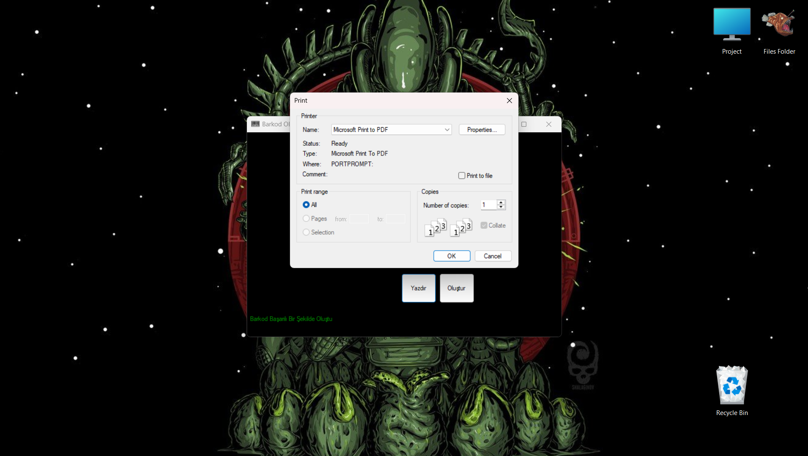

# GenerateBarcode

**GenerateBarcode**, C# programlama dili kullanılarak geliştirilmiş bir barkod oluşturma uygulamasıdır. Bu uygulama, kullanıcıların çeşitli barkod türleri oluşturmasına ve bunları görüntülemesine olanak tanır.

## 📌 Özellikler

- **Çeşitli Barkod Türleri**:  
  Uygulama, farklı barkod türlerini destekleyerek kullanıcıların ihtiyaçlarına uygun barkodlar oluşturmasına imkan sağlar.  
- **Kullanıcı Dostu Arayüz**:  
  Basit ve anlaşılır bir arayüz ile kullanıcıların kolaylıkla barkod oluşturmasına olanak tanır.  

## 🖼️ Ekran Görüntüleri

Ana ekran:  

Barkod oluşturma örneği:  

